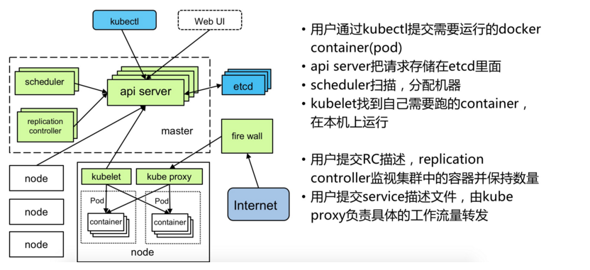

# Kubernetes学习笔记

## 1.Kubernetes基本概念

### 1.1 Master

Master是K8S里的集群控制节点，每个K8S集群里需要一个Master节点来负责整个集群的管理和控制，基本上K8S所有的命令都是发给它，它来负责具体的执行过程。

Master节点上运行着以下一组关键进程：

- Kubernetes API Server，提供了HTTP Rest接口的关键服务进程，是Kubernetes里所有资源增、删、改、查等操作的唯一入口，也是集群控制的入口进程。
- Kubernetes Controller Manager，Kubernetes里所有资源对象的自动化控制中心，可以理解为资源对象的“大总管”

- Kubernetes Scheduler，负责资源调度（Pod调度）的进程，相当于公交公司的“调度室”

- etcd Server，Kubernetes里的所有资源对象的数据都是保存在etcd中的

### 1.2 Node

除了Master之外的运行在Kubernetes集群中的节点成为Node节点。Node节点是Kubernetes集群中的工作负载节点，每个Node都会被Master分配一些工作负载（Docker容器），当某个容器宕机时，其上的工作负载会被Master自动转移到其他节点上去。

每个Node节点都运行着以下一组关键进程：

- kubelet：负责Pod对应的容器的创建、启停等任务，同时与Master节点密切协作，实现集群管理的基本功能。
- kube-proxy：实现Kubernetes Service的通信与负载均衡机制的重要组件。
- Docker Engine：Docker引擎，负责本机的容器创建和管理工作。

### 1.3 Pod

Pod是Kubernetes中管理，创建，计划的最小单元。每个Pod都有一个特殊的被称为“根容器”的Pause容器。Pause容器对应的镜像属于Kubernetes平台的一部分，除了Pause容器，每个Pod还包含一个或多个紧密相关的用户业务容器。如图1.1所示

图1.1 Pod的组成与容器的关系

Kubernetes为每个Pod都分配了唯一的IP地址，称之为Pod IP，一个Pod里的多个容器共享Pod IP地址。在Kubernetes里，一个Pod里的容器与另外主机上的Pod容器能够直接通信。

Pod有两种类型：普通的Pod及静态的Pod。

静态的Pod并不存放在Kubernetes的etcd存储里，而是存放在某个具体的Node上的一个具体文件中，并且只在此Node上启动运行。

普通的Pod一旦被创建，就会被放入到etcd中存储，随后会被Kubernetes Master调度到某个具体的Node上并进行绑定，随后该Pod被对应的Node上的kubelet进程实例化成一组相关的Docker容器并启动起来。在默认情况下，当Pod里的某个容器停止时，Kubernetes会自动检测到这个问题并且重新启动这个Pod（重启Pod里的所有容器），如果Pod所在的Node宕机，则会将这个Node上的所有Pod重新调度到其他节点上。Pod、容器与Node的关系如图1.2所示。

图1.2 Pod、容器与Node的关系

Endpoint（Pod IP + ContainerPort）是Pod里的一个服务进程的对外通信地址。一个Pod可能有多个Endpoint。

Pod Volume是定义在Pod之上，然后被各个容器挂载到自己的文件系统中的。

Event是一个事件的记录，记录了事件的最早产生事件、最后重现时间、重复次数、发起者、类型，以及导致此事件的原因等众多信息。Event通常会关联到某个具体的资源对象上，是排查故障的重要参考信息。

Pod及其周边对象的示意如图1.3所示

 图1.3 Pod及周边对象

### 1.4 Label

一个Label是一个key=value的键值对，其中key与value由用户自己指定。Label可以附加到各种资源上，例如Node、Pod、Service、RC等。一个资源对象可以定义任意数量的Label，同一个Label也可以被添加到任意数量的资源对象上去，Label通常在资源对象定义时确定，也可以在对象创建后动态添加或者删除。

Label Selector在Kubernetes中的重要使用场景有以下几处：

- kube-controller进程通过资源对象RC上定义的Label Selector来筛选要监控的Pod副本的数量，从而实现Pod副本的数量始终符合预期设定的全自动控制流程。
- kube-proxy进程通过Service的Label Selector来选择对应的Pod，自动建立起每个Service到对应Pod的请求转发路由表，从而时间Service的智能负载均衡机制。
- 通过对某些Node定义特定的Label，并且在Pod定义文件中使用NodeSelector这种标签调度策略，kube-scheduler进程可以实现Pod“定向调度”的特性。

总结：使用Label可以给对象创建多组标签，Label和Label Selector共同构成了Kubernetes系统中最核心的应用模型，使得被管理对象能够被精细地分组管理。同时实现了整个集群的高可用性。

### 1.5 Replication Controller (RC)

RC定义了一个期望的场景，即声明某种Pod的副本数量在任意时刻都符合某个预期值。RC的特性与作用：

- 在大多数情况下，通过定义一个RC实现Pod的创建过程及副本数量的自动控制
- RC里包括完整的Pod定义模板
- RC通过Label Selector机制实现对Pod副本的自动控制
- 通过改变RC里的Pod副本数量，可以实现Pod的扩容或缩容功能
- 通过改变RC里Pod模板中的镜像版本，可以实现Pod的滚动升级功能

由于Replication Controller与Kubernetes代码中的模块Replication Controller同名，同时这个词也无法准确表达它的本意，所以在Kubernetes 1.2的时候，它就升级成了另外一个新的概念——Replica Set，官方解释为“下一代的RC”，它与当前RC的唯一区别是：Replica Sets支持基于集合的Label selector，而RC只支持基于等式的Label Selector，这使得Replica Set的功能更强。

### 1.6 Deployment

Deployment引入的目的是为了更好地解决Pod的编排问题。为此，Deployment在内部使用了Replica Set来实现目的，可以把它看做RC的一次升级。

Deployment相对于RC的一个最大升级是可以随时知道当前Pod“部署”的进度。

Deployment的典型使用场景有以下几个：

- 创建一个Deployment对象来生成对应的Replica Set并完成Pod副本的创建过程。
- 检查Deployment的状态来看部署动作是否完成。
- 更新Deployment以创建新的Pod
- 如果当前Deployment不稳定，则回滚到一个早先的Deployment版本
- 挂起或者恢复一个Deployment

### 1.7 Horizontal Pod Autoscaler (HPA)

Horizontal Pod Autoscaler简称HPA，意思是Pod横向自动扩容，也属于一种Kubernetes资源对象。通过追踪分析RC控制的所有目标Pod的负载变化情况，来确定是否需要针对性地调整目标Pod的副本数，这是HPA的实现原理。当前，HPA可以有以下两种方式作为Pod负载的度量指标：

- CPUUtilizationPercentage，即目标Pod所有副本自身的CPU利用率的平均值。
- 应用程序自定义的度量指标，比如服务在每秒内的相应请求数。

### 1.8 Service

Service是对一组Pod的抽象，它会根据访问策略（如负载均衡策略）来访问这组Pod。之前的Pod、RC等资源对象其实都是为Service做“嫁衣”的。图1.4显示了Pod、RC与Service的逻辑关系。

图1.4 Pod、RC与Service的关系

Kubernetes的Service定义了一个服务的访问入口地址，前段的应用（Pod）通过这个入口地址访问其背后的一组由Pod副本组成的集群实例，Service与其后端Pod副本集群之间则是通过Label Selector来实现“无缝对接的。而RC的作用实际上是保证Service的服务能力和服务质量始终处于预期的标准。

每个Service分配了一个全局唯一的虚拟IP地址，这个虚拟IP被称为Cluster IP。这样一来，每个服务就变成了具备唯一IP地址的“通信节点”，服务调用就变成了最基础的TCP网络通信问题。

### 1.9 Volumn

Kubernetes中的Volume定义在Pod上，然后被一个Pod里的多个容器挂在到具体的文件目录下。Kubernetes中的Volume与Pod的生命周期相同，但与容器的生命周期不相关，当容器终止或者重启时，Volume中的数据也不会丢失。Kubernetes支持多种类型的文件系统。

Kubernetes提供的Volume类型有：

- emptyDir。一个emptyDir是在Pod分配到Node时创建的。它的初始内容为空，并且无须指定宿主机上对应的目录文件，因为这是Kubernetes自动分配的一个目录，当Pod从Node上移除时，emptyDir中的数据也会被永久删除。
- hostPath。hostPath为在Pod上挂在宿主机上的文件或目录，它通常可用于以下几方面：
  - 容器为应用程序生成的日志文件需要永久保存时，可以使用宿主机的告诉文件系统进行存储。
  - 需要访问宿舍主机上Docker引擎内部数据结构的容器应用时，可以通过定义hostPath为宿主机/var/lib/docker目录，使容器内部应用可以直接访问Docker的文件系统。
- gcePersistenDisk。使用这种类型的Volume表示使用谷歌共有运提供的永久磁盘（Persistent Disk）, PD存放Volume的数据，它与EmptyDir不同，PD上的内容会被永久保存，当Pod被删除时，PD只是被卸载，但不会被删除。需要先创建一个永久磁盘才能使用gcePersistenDisk。
- awsElasticBlockStore。与GCE类似，该类型的Volume使用亚马逊公有云提供的EBS Volume存储数据，需要先创建一个EBS Volume才能使用awsElasticBlockStore。
- NFS。使用NFS文件系统提供的共享目录存储数据时，需要在系统中部署一个NFS Server。
- iscsi。使用iSCSI存储设备上的目录挂在到Pod中
- flocker。使用Flocker来管理存储
- glusterfs。使用开元GlusterFS网络文件系统的目录挂到Pod中
- rbd。使用Linux块设备共享存储挂在到Pod中。
- gitRepo。通过挂载一个空目录，并从GIT库clone一个git repository以供Pod使用
- secret。一个secret volume用于为Pod提供加密的信息。通过tmfs（内存文件系统）实现，所以这种类型的volume总是不会持久化的

### 1.10 Persistent Volume（PV）

Volume是定义在Pod上的，属于“计算资源”的一部分，而实际上，“网络存储”是相对独立于“计算资源”而存在的一种实体资源。PV可以理解成Kubernetes集群中的某个网络存储中对应的一块存储，它与Volume很类似，但有以下区别：

- PV只能是网络存储，不属于任何Node，但可以在每个Node上访问。
- PV并不是定义在Pod上的，而是独立于Pod之外定义。
- PV目前只有几种类型：GCE Persistent Disks、NFS、RBD、iSCSCI、AWS ElasticBlockStore、GlusterFS等。

PV是有状态的对象，它有以下几种状态：

- Available：空闲状态
- Bound：已经绑定到某个PVC上
- Released：对应的PVC已经删除，但资源还没有被集群收回
- Failed：PV自动回收失败

### 1.11 Namespace（命名空间）

Namespace在很多情况下用于实现多租户的资源隔离。Namespace通过将集群内部资源对象“分配”到不同的Namespace中，形成逻辑上分组的不同项目、小组或用户组，便于不同的分组在共享使用整个集群的资源的同时还能被分别管理。

### 1.12 Annotation（注解）

Annotation与Label类似，也使用key/value及键值对的形式进行定义。不同的是Label具有严格的命名规则，它定义的是Kubernetes对象的元数据（Metadata），并且用于Label Selector。而Annotation则是用户任意定义的“附加”信息，以便于外部工具进行查找，很多时候，Kubernetes的模块自身会通过Annotation的方式标记资源对象的一些特殊信息。

通常来说，用Annotation来记录的信息如下：

- build信息、release信息、Docker镜像信息等，例如时间戳、release id号、PR号、镜像hash值、docker registry地址等
- 日志库、监控库、分析库等资源库的地址信息
- 程序调试工具信息，例如工具名称、版本号等
- 团队的联系信息，例如电话号码、负责人名称、网址等

### 1.13 小结

图1.5显示了Kubernetes的架构和组件

图1.5 Kubernetes架构和组件

### 1.14 Custon Resource Definition（CRD）

在Kubernetes中一切都可视为资源，Kubernetes 1.7之后增加了对CRD自定义资源二次开发能力来扩展Kubernetes API，通过CRD我们可以向Kubernetes API中增加新资源类型，而不需要修改Kubernetes源码或创建自定义的API Server，该功能大大提高了Kubernetes的扩展能力。

当创建一个新的CRD时，Kubernetes API服务器将为指定的每个版本创建一个新的RESTful资源路径可以根据该api路径来创建一些自定义的类型资源。CRD可以是命名空间的，也可以是集群范围的，由CRD的作用域(scpoe)字段中所指定的，与现有的内置对象一样，删除名称空间将删除该名称空间中的所有自定义对象。CRD本身没有名称空间，所有名称空间都可以使用。

## 2.Kubernetes基本原理

REST全称是Representational State Transfer，表述性状态转移。它是由罗伊·菲尔丁（Roy Fielding）提出的，是用来描述创建HTTP API的标准方法的，他发现这四种常用的行为 （增、删、改、查）都可以直接映射到HTTP 中已实现的GET,POST,PUT和DELETE方法。

### 2.1 Kubernetes API Server 基本原理

Kubernetes API Server的核心功能是提供了Kubernetes各类资源对象（如Pod、RC、Service等）的增、删、改、查及Watch等HTTP Rest接口，成为集群内各个功能模块之间数据交互和通信的中心枢纽，是整个系统的数据总线和数据中心。除此之外，它还有以下一些功能特性：

- 是集群管理的API入口
- 是资源配额控制的入口
- 提供了完备的集群完全机制

Kubernetes API Server通过一个名为kube-apiserver的进程提供服务，该进程运行在Master节点上。在默认情况下，kube-apiserver进程在本机的8080端口提供REST服务。可以同时启动HTTPS安全端口来启动安全机制，加强REST API访问的安全性。

Kubernetes API Server最主要的REST接口是资源对象的增、删、改、查，除此之外，它还提供了一类很特殊的REST接口——Kubernetes Proxy API接口，这类接口的作用是代理REST请求，即Kubernetes API Server把收到的REST请求转发到某个Node上的kubelet守护进程的REST端口上，由该Kubelet进程负责响应。

图2.1显示了Kubernetes的结构。

图2.1 Kubernetes结构图

从上图可以看出，Kubernetes API Server作为集群的核心，负责集群个功能模块之间的通信。集群内的各个功能模块通过API Server将信息存入etcd，当需要获取和操作这些数据时，则通过API Server提供的REST接口来时间，从而实现各模块之间的信息交互。

常见的一个交互场景是kubelet进程与API Server的交互。每个Node节点上的kubelet每隔一个时间周期，就会调用一次API Server的REST接口报告自身状态，API Server接收到这些信息后，将节点状态信息更新到etcd中。此外，kubelet也通过API Server的Watch接口监听Pod信息，如果监听到新的Pod副本被调度绑定到本节点，则执行Pod对应的容器的创建和启动逻辑；若果监听到Pod对象被删除，则删除本节点上的相应的Pod容器；如果监听到修改该Pod信息，则kubelet监听到变化后，会相应地修改本节点的Pod容器。

另外一个交互场景是kube-scheduler与API Server的交互。当Scheduler通过API Server的Watch接口监听到新建Pod副本的信息后，它会检索所有符合该Pod要求的Node列表，开始执行Pod调度逻辑，调度成功后将Pod绑定到目标节点上。

为了环节集群各模块对API Server的访问压力，各功能模块都采用缓存机制来缓存数据。各功能模块定时从API Server获取指定的资源对象信息，然后将这些信息保存到本地缓存，功能模块在某些情况下不直接访问API Sever，而是通过访问缓存数据来间接访问API Server。

### 2.2 Controller Manager 基本原理

Controller Manager作为集群内部的管理控制中心，负责集群内的Node、Pod副本、服务端点（Endpoint）、命名空间（Namespace）、服务账号（ServiceAccount）、资源定额（ResourceQuota）等的管理，当某个Node意外宕机时，Controller Manager会及时发现此故障并执行自动化修复流程，确保集群始终处于预期的工作状态。

如图2.2所示，Controller Manager 内部包含Replication Controller、Node Controller、ResourceQuota Controller、Namespace Controller、ServiceAccount Controller、Token Controller、Service Controller及Endpoint Controller等多个Controller，每种Controller都负责一种具体的控制流程，而Controller Manager正是这些Controller的核心管理者。

图2.2 Controller Manager 结构图

在Kubernetes集群中与Controller Manager并重的另一个组件是Kubernetes Scheduler，它的作用是将等待调度的Pod（包括通过API Server新创建的Pod及RC为补足副本而创建的Pod等）通过一些复杂的调度流程计算出最佳目标节点，然后绑定到该节点上。

#### 2.2.1 Replication Controller

Replication Controller的核心作用是确保在任何时候集群中一个RC所关联的Pod副本数量保持预设值。如果发现Pod副本数量超过预设值，则Replication Controller会销毁一些Pod副本；反之，Replication Controller会自动创建新的Pod副本，直到符合条件的Pod副本数量达到预设值。

Replication Controller的职责总结如下：

- 确保当前集群中有且仅有N个Pod实例，N是RC中定义的Pod副本数量。
- 通过调整RC的spec.replicas属性值来实现系统扩容或者缩容。
- 通过改变RC中的Pod模板来实现系统的滚动升级

#### 2.2.2 Node Controller

kubelet进程在启动时通过API Server注册自身的节点信息，并定时向API Server汇报状态信息，API Server接受到这些信息后，将这些信息更新到etcd中，etcd中存储的节点信息包括节点健康状况、节点资源、节点名称、节点地址信息、操作系统版本、Docker版本、kubelet版本等。节点健康状况包含“就绪”（True）“未就绪”（False）和”未知“（Unknown）三种。

Node Controller通过API Server实时获取Node的相关信息，实现管理和监控集群中的各个Node节点的相关控制功能，Node Controller的核心工作流程如图2.3所示。

图2.3 Node Controller流程图

#### 2.2.3 ResourceQuota Controller

作为完备的企业级的容器集群管理平台，Kubernetes也提供了资源配额管理（ResourceQuota Controller）这一高级功能，资源配额管理确保了指定的对象在任何时候都不会超量占用系统物理资源，避免了由于某些业务进程的设计或实现的缺陷导致整个系统运行紊乱甚至意外宕机，对整个集群的平稳运行和稳定性有非常重要的作用。

#### 2.2.4 Namespace Controller

用户通过API Server可以创建新的Namespace并保存在etcd中，Namespace Controller定时通过API Server读取这些Namespae信息。如果Namespace被API标识为优雅删除（通过设置删除期限，及Deletion Timestamp属性被设置），则将该Namespace的状态设置成"Terminating"并保存到etcd中。同时Namespace Controller删除该Namespace下的ServiceAccount、RC、Pod、Secret、PersistentVolume、ListRange、ResourceQuota和Event等资源对象，

当Namespace的状态被设置成“Termaintaing”后，由Admission Controller的NamespaceLifecycle插件来阻止为该Namespace创建新的资源。同时，在Namespace Controller删除完该Namespace中的所有资源对象后，Namespace Controller对该Namespace执行finalize操作，删除Namespace的spec.finalizer域中的信息。

如果Namespace Controller观察到Namespace设置了删除期限，同时Namespace的spec.finalizers域值是空的，那么Namespace Controller将通过API Server删除对该Namespace资源。

#### 2.2.5 Service Controller 与 Endpoint Controller

Endpoint表示了一个Service对应的所有Pod副本的访问地址，而Endpoints Controller就是负责生成和维护所有Endpoints对象的控制器。它负责监听Service和对应的Pod副本的变化，如果监测到Service被删除，则删除和该Service同名的Endpoints对象；如果监测到新的Service被创建或者修改，则根据该Service信息获得相关的Pod列表，然后创建或者更新Service对应的Endpoints对象。如果监测到Pod的事件，则更新它所对应的Service的Endpoints对象（增加、删除或者修改对应的Endpoint条目）。

Endpoints对象在每个Node上的kube-proxy进程上被使用。kube-proxy进程获取每个Service的Endpoints，实现了Service的负载均衡功能。

Service Controller是属于Kubernetes集群与外部的云平台之间的一个接口控制器。Service Controller监听Service的变化，如果是一个LoadBalancer类型的Service，则Service Controller确保外部的云平台上该Service对应的LoadBalancer实例被相应地创建、删除及更新路由转发表。

### 2.3 Scheduler 基本原理

Kubernetes Scheduler在整个系统中承担了“承上启下”的重要功能，“承上”是指它负责接受Controller Manager创建的新Pod，为其安排一个目标Node；“启下”是指安置工作完成后，目标Node上的kubelet服务进程接管后继工作，负责Pod生命周期中的“下半生”。

具体来说，Kubernetes Scheduler的作用是将待调度的Pod（API新创建的Pod、Controller Manager为补足副本而创建的Pod等）按照特定的调度算法和调度策略绑定到集群中的某个合适的Node上，并将绑定信息写入etcd中。在整个调度过程中设计三个对象，分别是：待调度Pod列表、可用Node列表，以及调度算法和策略。简单地说，就是通过调度算法调度为待调度Pod列表的每个Pod从Node列表中选择一个最合适的Node。

随后，目标节点上的kublet通过API Server监听到Kubernetes Scheduler产生的Pod绑定事件，然后获取对应的Pod清单，下载Image镜像，并启动容器。

### 2.4 kubelet 基本原理

在Kubernetes集群中，在每个Node节点上都会启动一个kubelet服务进程。该进程用于处理Master节点下发到本节点的任务，管理Pod及Pod中的容器。每个kubelet进程会在API Server上注册节点自身的信息，定期向Master节点汇报节点资源的使用情况，并通过cAdvisor监控容器和节点资源。

### 2.5 Kube-proxy 基本原理

Kubernetes在创建服务时会为服务分配一个虚拟的IP地址，客户端通过访问这个虚拟的IP地址来访问服务，而服务则负责将请求转发到后端的Pod上。它的部署和启停是Kubernetes统一自动管理的。

在Kubernetes集群的每个Node上都会运行一个kube-proxy服务进程，这个进程可以看做Service的透明代理兼负载均衡器，其核心功能是将某个Service的访问请求转发到后端的多个Pod实例上。对每个TCP类型的Kubernetes Service，kube-proxy都会在本地的Node上建立一个SocketServer来负责接受请求，然后均匀发送到后端某个Pod的端口上，这个过程默认采用Round Robin负载均衡算法。另外，Kubernetes也提供通过修改Service的service.spec.sessionAffinity参数的值来实现回话保持特性的定向转发，如果设置的值为“ClientIP”，则将来自同一个ClientIP的请求都转发到同一个后端Pod上。

此外，Service的ClusterIP与NodePort等概念是kube-proxy服务通过Iptables的NAT转换实现的，kube-proxy在运行过程中动态创建与Service相关的Iptables规则，这些规则实现了Cluster IP及NodePort的请求流量重定向到kube-porxy进程上对应服务的代理端口的功能。由于Iptables机制针对的是本地的kube-proxy端口，所以每个Node上都要运行kube-proxy组件，这样以来，在Kubernetes集群内部，我们可以在任意Node上发起对Service的访问请求。

综上所述，由于kube-proxy的作用，在Service的调用过程中客户端无须关心后端有几个Pod，中间过程的通信、负载均衡及故障恢复都是透明的，如图2.4所示。

图2.4 Service 的负载均衡转发机制

